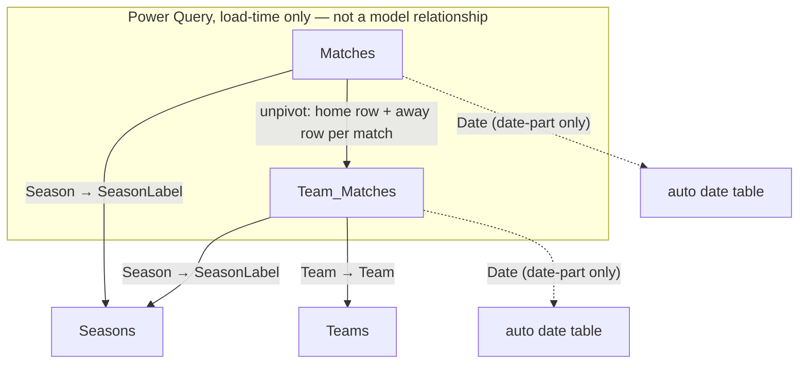

# Premier League Analytics

A Power BI dashboard answering two related questions about the English Premier
League: how has each team performed across a season (points, goals, goal
difference), and how much of that performance is a home-field effect rather than
team quality. Eleven seasons (2015/16 through 2025/26) are covered, sourced from
published match-by-match results.

## Screenshots

### League Overview

A season-filterable standings table (matches played, goals for/against, goal
difference, points), three KPI cards (total goals, the season's champion, and
goals per match), and a "Goals Scored vs Conceded" scatter of every team with
dashed reference lines marking the league-average goals for and against — teams
in the lower-right are outscoring and out-defending the league average.

### Home Advantage

A "Home vs Away Form" scatter of away points-per-game vs. home points-per-game
per team (teams above the diagonal do better at home), next to a "Home Advantage
by Team" bar chart sorted from largest home boost to largest away-from-home edge,
with negative bars (teams that do better away) coloured red against the default
navy.

## Data model

**Matches** — one row per match, wide format (home/away columns side by side),
loaded directly from `matches_combined.csv`. Columns: `Date`, `HomeTeam`,
`AwayTeam`, full/half-time goals and result (`FTHG`/`FTAG`/`FTR`,
`HTHG`/`HTAG`/`HTR`), `Referee`, shots and shots-on-target (`HS`/`AS`/`HST`/`AST`),
fouls (`HF`/`AF`), corners (`HC`/`AC`), cards (`HY`/`AY`/`HR`/`AR`), and `Season`.

**Team_Matches** — one row per **team per match** (so twice the row count of
`Matches`). Built entirely in Power Query by unpivoting `Matches` into a home
perspective and an away perspective and stacking them, tagging each with
`IsHome`. This is what makes "home vs. away" and "per-team" measures possible
without row-level DAX gymnastics. Adds `Result` (W/D/L) and `Points` (3/1/0), plus
two calculated columns for match sequencing: `Match Number` (dense rank of a
team's matches by date, across all seasons) and `Match Number In Season` (same,
restarted each season).

**Teams** — one row per team, the distinct `Team` values from `Team_Matches`.

**Seasons** — one row per season. ⚠️ **Column names here are swapped from what
they suggest.** The Power Query builds a human-readable label like `"2015/16"`
and a raw code like `"1516"`, then renames them backwards: the column named
`Season` holds the **formatted label** (`"2015/16"`), and the column named
`SeasonLabel` holds the **raw code** (`"1516"`). The model relationships join on
the raw-code column, i.e. on `SeasonLabel` — so if you're tracing a relationship
and it looks like it's pointing at the wrong field, this is why.



Note that `Matches` and `Team_Matches` have **no relationship to each other** in
the model — `Team_Matches` is derived from `Matches` at load time, not linked to
it live, so they're queried independently.

## Key measures

Core aggregates — straightforward sums, counts, and ratios with no
context-transition tricks:

```dax
Total Points        = SUM(Team_Matches[Points])
Total Goals For      = SUM(Team_Matches[GoalsFor])
Total Goals Against  = SUM(Team_Matches[GoalsAgainst])
Matches Played       = COUNTROWS(Team_Matches)
Wins                 = CALCULATE(COUNTROWS(Team_Matches), Team_Matches[Result] = "W")
Goal Difference       = [Total Goals For] - [Total Goals Against]
Points Per Game       = DIVIDE([Total Points], [Matches Played])
Total Matches         = COUNTROWS(Matches)
Total Goals (League)  = SUM(Matches[FTHG]) + SUM(Matches[FTAG])
Goals Per Match        = DIVIDE([Total Goals (League)], [Total Matches])
```

The rest are worth walking through. First, the four measures behind the League
Overview page's KPI cards and scatter reference lines:

```dax
Total Goals = FORMAT([Total Goals (League)], "#,0")
```
A pure display wrapper, not a new calculation — `[Total Goals (League)]` already
holds the number. The KPI card needed a comma-thousands-separated value
(`"1,115"`), and `FORMAT()` was used to produce that as text rather than relying
on the visual's own number formatting. The tradeoff: because `FORMAT()` returns
text, this measure can't be reused in further arithmetic the way a numeric
measure could.

```dax
Champion =
CALCULATE(
    SELECTEDVALUE(Teams[Team]),
    TOPN(1, ALLSELECTED(Teams), [Total Points], DESC)
)
```
This is a "top-N as a scalar" pattern. `TOPN(1, ALLSELECTED(Teams), [Total
Points], DESC)` ranks every team (ignoring any single-team highlight from
clicking a data point elsewhere, but still respecting the season slicer via
`ALLSELECTED`) and keeps only the top one by points. `CALCULATE` then applies
that one-row table as filter context, so `SELECTEDVALUE(Teams[Team])` — which
would normally return blank or an error across multiple teams — resolves
cleanly to a single name, because the filter context now contains exactly one
team.

```dax
Avg Goals For = AVERAGEX(ALLSELECTED(Teams), [Total Goals For])
Avg Goals Against = AVERAGEX(ALLSELECTED(Teams), [Total Goals Against])
```
These drive the scatter chart's reference lines. `ALLSELECTED(Teams)` is doing
the same job as in `Champion`: it keeps the season slicer's filter but ignores
per-team cross-highlighting, so clicking one team's dot on the scatter doesn't
drag the average line to that team's own value — the reference lines stay fixed
at "the league average for the selected season" regardless of what's clicked.

Then the measures behind the Home Advantage page, where the payoff of the
`Team_Matches` unpivot shows up — a "home" or "away" filter is just a `WHERE`
clause on `IsHome`, not a self-join:

```dax
Home Points = CALCULATE([Total Points], Team_Matches[IsHome] = TRUE())
Away Points = CALCULATE([Total Points], Team_Matches[IsHome] = FALSE())
```
Each match contributes two rows to `Team_Matches` (one per side), so filtering
`IsHome` selects exactly one side's perspective per match. There's no need to
distinguish "was this team the home team in this match" any other way.

```dax
Home Points Per Game =
DIVIDE(
    [Home Points],
    CALCULATE([Matches Played], Team_Matches[IsHome] = TRUE())
)

Away Points Per Game =
DIVIDE(
    [Away Points],
    CALCULATE([Matches Played], Team_Matches[IsHome] = FALSE())
)
```
The denominator can't reuse `[Matches Played]` directly — that measure counts
*all* of a team's matches, home and away combined. Each of these re-applies the
`IsHome` filter to `CALCULATE([Matches Played], ...)` so the denominator matches
the numerator's slice (home matches only, or away matches only).

```dax
Home Advantage = [Home Points Per Game] - [Away Points Per Game]
```
Simple once the two measures above exist — this is what drives the diverging bar
chart on the "Home Advantage" page. Positive means the team earns more points at
home than away; negative means the reverse.

```dax
Rolling Form (Last 5) =
VAR CurrentMatchNum = MAX(Team_Matches[Match Number In Season])
VAR CurrentTeam = MAX(Team_Matches[Team])
VAR CurrentSeason = MAX(Team_Matches[Season])
RETURN
CALCULATE(
    SUM(Team_Matches[Points]),
    FILTER(
        ALL(Team_Matches),
        Team_Matches[Team] = CurrentTeam
        && Team_Matches[Season] = CurrentSeason
        && Team_Matches[Match Number In Season] <= CurrentMatchNum
        && Team_Matches[Match Number In Season] > CurrentMatchNum - 5
    )
)
```
This one does a real window reset. Its filter context for a given row is just
"this team, this match" — on its own that would return a single match's points,
not a trailing sum. The three `VAR`s capture that row's team, season, and
match-number *before* the filter context is touched. Then `ALL(Team_Matches)`
clears the existing filter context entirely, and the `FILTER` rebuilds a window
by hand: same team, same season, and a match-number range of `(CurrentMatchNum
- 5, CurrentMatchNum]` — the trailing 5 matches, inclusive of the current one.

`Team_Matches[Season]` is deliberately part of that filter, not an afterthought.
Without it, the window would be keyed on `Match Number` (the dense rank across
*all* seasons) or would let a `Match Number In Season` window slide past
match 1 into the previous season's final matches — e.g. a team's 2nd match of
a new season would pull in 3 matches from the season before to fill out a
"last 5," blending form across a summer transfer window and promotion/relegation
as if nothing happened. Filtering on season as well as match number keeps each
season's form calculation self-contained, at the cost of the first 4 matches of
every season having a shorter-than-5 window (there's nothing earlier in that
season to borrow from).

This measure is currently defined in the model but not bound to any visual on
either report page — it was built for a "Form Over Time" line chart that's since
been removed.

## How to run

1. Regenerate the source data (requires `pandas`; fetches 11 seasons live from
   football-data.co.uk):
   ```
   pip install pandas
   python build_matches_csv.py
   ```
   This writes `matches_combined.csv` into whichever directory you run it from.
2. The semantic model's `Matches` table currently points at an absolute path
   (`C:\Users\vakom\OneDrive\Desktop\matches_combined.csv`) rather than a path
   relative to this project. Either run the script from that exact location, or
   open the `.pbix`/`.pbip` in Power BI Desktop and repoint the `Matches` query's
   source step (Transform Data → `Matches` → `Source`) at wherever you generated
   the CSV.
3. Open `premier-league.pbip` (or `premier-league.pbix`) in Power BI Desktop.
