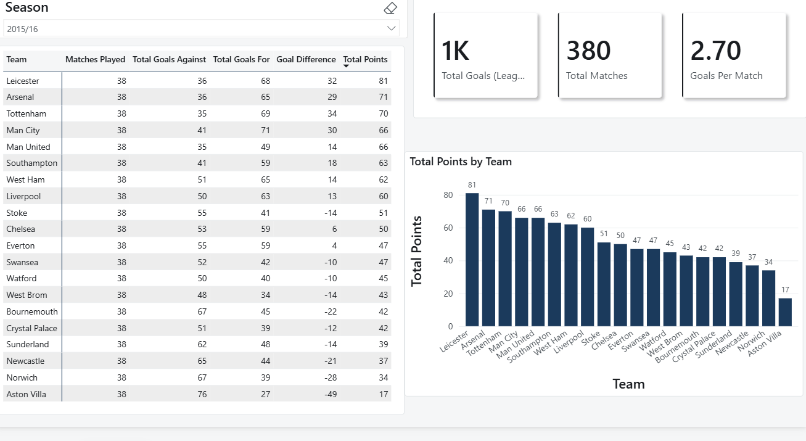
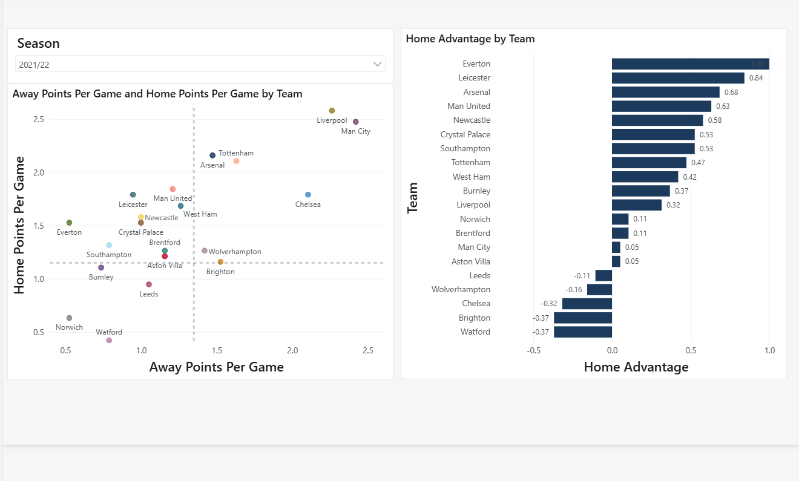
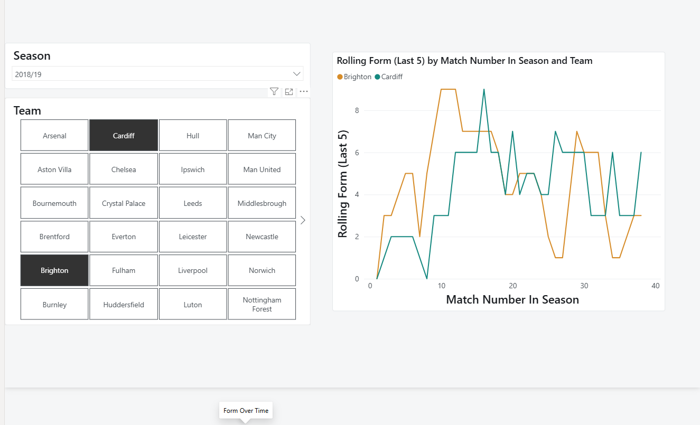
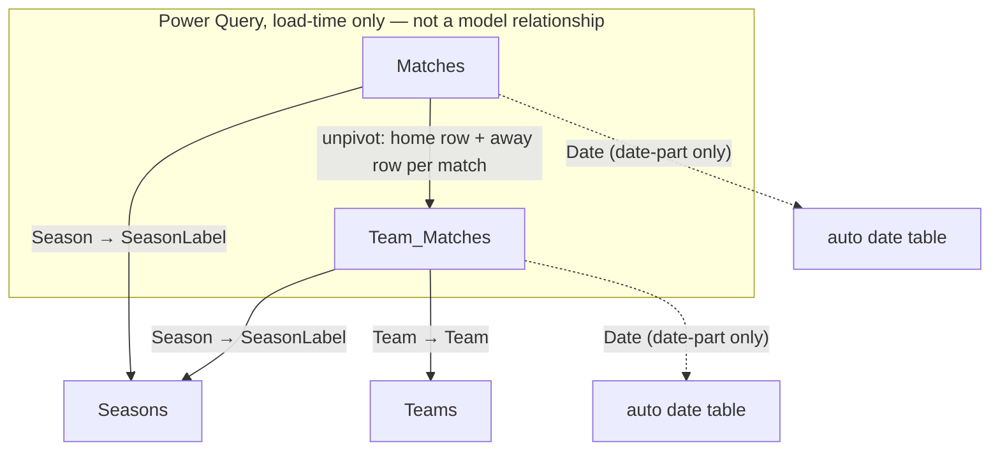

# Premier League Analytics

A Power BI dashboard answering three related questions about the English Premier
League: how has each team performed across a season (points, goals, form), how
much of that performance is a home-field effect rather than team quality, and how
did a team's results trend week to week within a season. Eleven seasons (2015/16
through 2025/26) are covered, sourced from published match-by-match results.

## Screenshots

### League Overview

Season-level standings table (matches played, goals for/against, goal difference,
points) next to a ranked bar chart of total points by team — the classic league
table view, filterable by season.

### Home Advantage

Two views of the same idea: a scatter of away points-per-game vs. home
points-per-game per team (teams above the diagonal do better at home), and a
diverging bar chart of each team's `Home Advantage` measure, sorted from largest
home boost to largest away-from-home edge.

### Form Over Time

A rolling 5-match points total per team, plotted by match number within the
season, with a team-tile slicer for picking which teams to compare — shows
whether a team's form is trending up or down independent of season-long totals.

## Data model

**Matches** — one row per match, wide format (home/away columns side by side),
loaded directly from `matches_combined.csv`. Columns: `Date`, `HomeTeam`,
`AwayTeam`, full/half-time goals and result (`FTHG`/`FTAG`/`FTR`,
`HTHG`/`HTAG`/`HTR`), `Referee`, shots and shots-on-target (`HS`/`AS`/`HST`/`AST`),
fouls (`HF`/`AF`), corners (`HC`/`AC`), cards (`HY`/`AY`/`HR`/`AR`), and `Season`.

**Team_Matches** — one row per **team per match** (so twice the row count of
`Matches`). Built entirely in Power Query by unpivoting `Matches` into a home
perspective and an away perspective and stacking them, tagging each with
`IsHome`. This is what makes "home vs. away" and "per-team" measures possible
without row-level DAX gymnastics. Adds `Result` (W/D/L) and `Points` (3/1/0), plus
two calculated columns used for the rolling-form measure: `Match Number` (dense
rank of a team's matches by date, across all seasons) and `Match Number In Season`
(same, restarted each season).

**Teams** — one row per team, the distinct `Team` values from `Team_Matches`.

**Seasons** — one row per season. ⚠️ **Column names here are swapped from what
they suggest.** The Power Query builds a human-readable label like `"2015/16"`
and a raw code like `"1516"`, then renames them backwards: the column named
`Season` holds the **formatted label** (`"2015/16"`), and the column named
`SeasonLabel` holds the **raw code** (`"1516"`). The model relationships join on
the raw-code column, i.e. on `SeasonLabel` — so if you're tracing a relationship
and it looks like it's pointing at the wrong field, this is why.



Note that `Matches` and `Team_Matches` have **no relationship to each other** in
the model — `Team_Matches` is derived from `Matches` at load time, not linked to
it live, so they're queried independently.

## Key measures

Core aggregates — straightforward sums, counts, and ratios with no
context-transition tricks:

```dax
Total Points        = SUM(Team_Matches[Points])
Total Goals For      = SUM(Team_Matches[GoalsFor])
Total Goals Against  = SUM(Team_Matches[GoalsAgainst])
Matches Played       = COUNTROWS(Team_Matches)
Wins                 = CALCULATE(COUNTROWS(Team_Matches), Team_Matches[Result] = "W")
Goal Difference       = [Total Goals For] - [Total Goals Against]
Points Per Game       = DIVIDE([Total Points], [Matches Played])
Total Matches         = COUNTROWS(Matches)
Total Goals (League)  = SUM(Matches[FTHG]) + SUM(Matches[FTAG])
Goals Per Match        = DIVIDE([Total Goals (League)], [Total Matches])
```

The rest are worth walking through, because the payoff of the `Team_Matches`
unpivot shows up here — a "home" or "away" filter is just a `WHERE` clause on
`IsHome`, not a self-join:

```dax
Home Points = CALCULATE([Total Points], Team_Matches[IsHome] = TRUE())
Away Points = CALCULATE([Total Points], Team_Matches[IsHome] = FALSE())
```
Each match contributes two rows to `Team_Matches` (one per side), so filtering
`IsHome` selects exactly one side's perspective per match. There's no need to
distinguish "was this team the home team in this match" any other way.

```dax
Home Points Per Game =
DIVIDE(
    [Home Points],
    CALCULATE([Matches Played], Team_Matches[IsHome] = TRUE())
)

Away Points Per Game =
DIVIDE(
    [Away Points],
    CALCULATE([Matches Played], Team_Matches[IsHome] = FALSE())
)
```
The denominator can't reuse `[Matches Played]` directly — that measure counts
*all* of a team's matches, home and away combined. Each of these re-applies the
`IsHome` filter to `CALCULATE([Matches Played], ...)` so the denominator matches
the numerator's slice (home matches only, or away matches only).

```dax
Home Advantage = [Home Points Per Game] - [Away Points Per Game]
```
Simple once the two measures above exist — this is what drives the diverging bar
chart on the "Home Advantage" page. Positive means the team earns more points at
home than away; negative means the reverse.

```dax
Rolling Form (Last 5) =
VAR CurrentMatchNum = MAX(Team_Matches[Match Number In Season])
VAR CurrentTeam = MAX(Team_Matches[Team])
VAR CurrentSeason = MAX(Team_Matches[Season])
RETURN
CALCULATE(
    SUM(Team_Matches[Points]),
    FILTER(
        ALL(Team_Matches),
        Team_Matches[Team] = CurrentTeam
        && Team_Matches[Season] = CurrentSeason
        && Team_Matches[Match Number In Season] <= CurrentMatchNum
        && Team_Matches[Match Number In Season] > CurrentMatchNum - 5
    )
)
```
This is the measure behind the "Form Over Time" line chart, and it's the one
place in the model doing a real window reset. The line chart's visual context for
a given point is just "this team, this match" — on its own that would return a
single match's points, not a trailing sum. The three `VAR`s capture that point's
team, season, and match-number *before* the filter context is touched. Then
`ALL(Team_Matches)` clears the existing filter context entirely (otherwise the
chart's own per-point context would still be layered on top and the `FILTER`
would have nothing to widen), and the `FILTER` rebuilds a window by hand: same
team, same season, and a match-number range of `(CurrentMatchNum - 5,
CurrentMatchNum]` — the trailing 5 matches, inclusive of the current one. Season
is included in the match so form doesn't carry over across a summer break, and
`Match Number In Season` (rather than `Date`) is the axis so the window is
"5 matches back" regardless of gaps between fixtures.

## How to run

1. Regenerate the source data (requires `pandas`; fetches 11 seasons live from
   football-data.co.uk):
   ```
   pip install pandas
   python build_matches_csv.py
   ```
   This writes `matches_combined.csv` into whichever directory you run it from.
2. The semantic model's `Matches` table currently points at an absolute path
   (`C:\Users\vakom\OneDrive\Desktop\matches_combined.csv`) rather than a path
   relative to this project. Either run the script from that exact location, or
   open the `.pbix`/`.pbip` in Power BI Desktop and repoint the `Matches` query's
   source step (Transform Data → `Matches` → `Source`) at wherever you generated
   the CSV.
3. Open `premier-league.pbip` (or `premier-league.pbix`) in Power BI Desktop.
